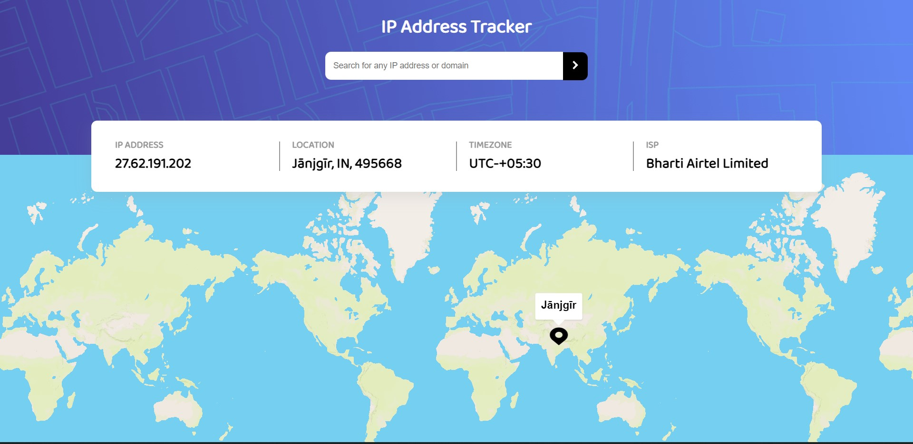

# Frontend Mentor - IP address tracker
## Welcome! 👋
This is a IP address tracker made using react, mapbox and ipify API.

## Table of contents

- [Overview](#overview)
  - [Screenshot](#screenshot)
  - [Links](#links)
  - [Built with](#built-with)
- [Author](#author)

## Overview
This challenge is an Intermediate level challenge in Frontend Mentor. It is an IP address tracker made using react, mapbox and ipify API for geolocation.

### Screenshot

### Links

- Solution URL: [Solution URL](https://github.com/Saicharan0662/social-media-dashboard-with-theme-switcher)

### Built with

- react.js
- Semantic HTML5 markup
- CSS3
- Flexbox
- mapbox
- ipify API
- media queries

## Author

- Website - [Sai Charan](https://saicharan006.netlify.app/)
- Frontend Mentor - [@Saicharan0662](https://www.frontendmentor.io/profile/Saicharan0662)